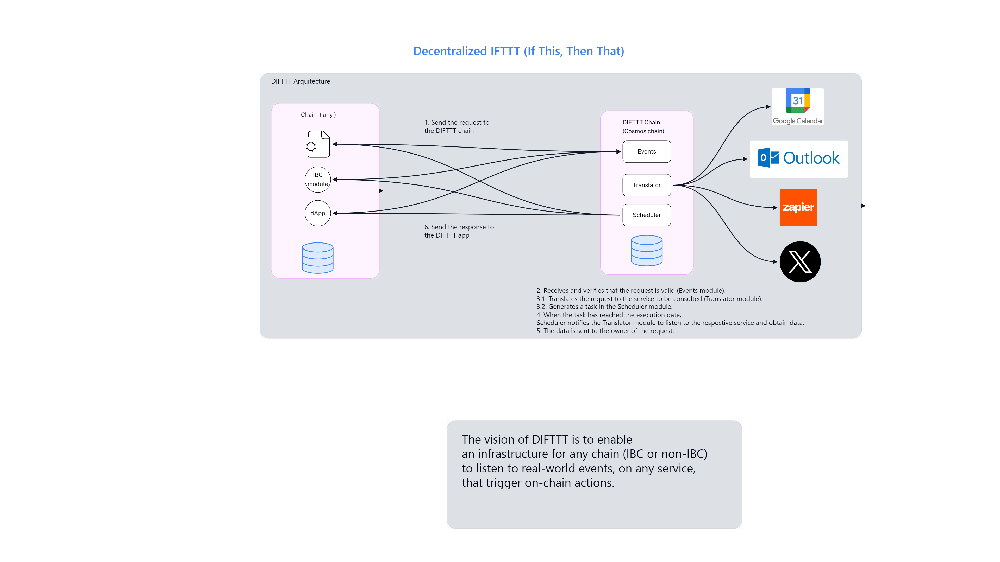

# DIFTTT (Decentralized IF This, Then That).

**DIFFFT** will be a chain and IBC modules that enable any Blockchain chain to listen to events and actions that occur in any Web service (e.g. Gmail, Outlook, Zapier), in a decentralized way.

The benefits will be:

- Any chain will be able to receive events from DIFTTT, whether in a Smart contract, an IBC module or a dApp (frontend or backend).
- Any developer can enable new events and actions available in DIFTTT, expanding the range of options and services.
- DIFTTT nodes will be able to receive benefits (tokens) in exchange for contributing to the reception of requests and sending responses.

JSON template for [Idea Builder](https://ideabuilder.ibcprotocol.dev/): https://github.com/nescampos/difttt/blob/main/DIFTTT.json

## DIFTTT Architecture

